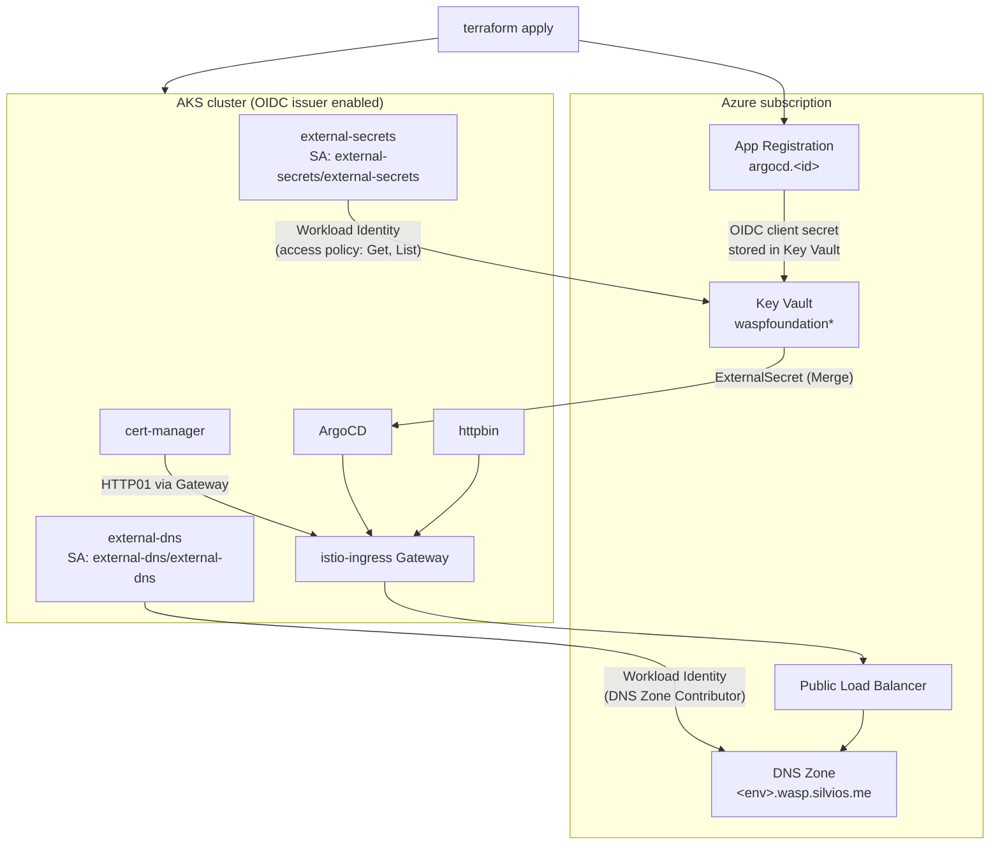

# cluster_argocd_ingress_istio

AKS cluster with a full GitOps stack, using **Istio** as the ingress layer and
**Azure AD Workload Identity** for every in-cluster component that talks to
Azure APIs.

This is the **only example already migrated** to `azurerm >= 5.0` /
`azuread >= 3.0` / `helm >= 3.0`. The other four examples still pin older
provider versions and are intentionally broken with respect to the shared
modules in `src/` — see the root [`CLAUDE.md`](../../CLAUDE.md) for the
migration strategy.

## What this example provisions

Each block is controlled by an `install_*` flag in [`main.tf`](main.tf).

| Component | Flag | Default | Source module | What it does |
| --- | --- | --- | --- | --- |
| Resource Group | — | always | [`main.tf`](main.tf) | one RG per cluster, named after it |
| VNet + subnets | — | always | `network.tf` (shared symlink) | `10.244.0.0/14`, subnets `aks` and `application_gateway` |
| AKS cluster | — | always | `src/cluster` | Kubernetes 1.35.7, autoscaling system pool 1–5, Azure CNI + Azure network policy, Azure RBAC, `oidc_issuer_enabled` + `workload_identity_enabled` |
| cert-manager | `install_cert_manager` | `true` | `src/helm/modules/cert-manager` | cert-manager v1.21.1 + `ClusterIssuer`s (Let's Encrypt) |
| external-secrets | `install_external_secrets` | `true` | `src/helm/modules/external-secrets` | ESO 2.9.0 + `ClusterSecretStore` `azure-subscription-key-vault` |
| external-dns | `install_external_dns` | `true` | `src/helm/modules/external-dns` | external-dns 0.21.0 writing records into the Azure DNS Zone |
| ingress-istio | `install_ingress_istio` | `true` | `src/helm/modules/ingress-istio` | Istio 1.30.3 (`istio-base`, `istio-discovery`, `istio-gateway`) + public LB |
| httpbin | `install_httpbin` | `true` | `src/helm/modules/httpbin` | smoke-test workload behind the Istio Gateway |
| ArgoCD | `install_argocd` | `true` | `src/helm/modules/argo-cd` + `src/active-directory/app-registration` | ArgoCD chart 10.4.0 (app v3.5.1) with Azure AD SSO |
| app-of-apps | `install_app_of_apps_infra` | `false` | `src/helm/modules/app-of-apps-infra` | bootstraps the external GitOps repo `smsilva/wasp-gitops` |

## Architecture



Two federated identities are created by `src/active-directory/workload-identity`
(user-assigned MI + federated credential on the cluster OIDC issuer):

| Identity | Namespace / ServiceAccount | Azure permission |
| --- | --- | --- |
| `<cluster>-external-secrets` | `external-secrets` / `external-secrets` | Key Vault access policy: `Get`, `List` |
| `<cluster>-external-dns` | `external-dns` / `external-dns` | `DNS Zone Contributor` on the DNS Zone |

No client secret for these components ever lands in the cluster.

## Prerequisites

See the root [`README.md`](../../README.md) for the full list. In short:

- `ARM_TENANT_ID`, `ARM_SUBSCRIPTION_ID`, `ARM_CLIENT_ID`, `ARM_CLIENT_SECRET` exported.
- The Terraform Service Principal needs **`User Access Administrator`**, not just
  `Contributor` — this example creates role assignments
  (`scripts/sp-grant-user-access-administrator --client-id ${ARM_CLIENT_ID}`).
- The Key Vault must already hold the ArgoCD secrets
  (`argocd-repo-creds-ssh-private-key-base64-encoded`,
  `argocd-repo-creds-url-github`, …).
- An existing Azure DNS Zone named after the subscription
  (`<environment>.wasp.silvios.me`).

## Usage

```bash
cd examples/cluster_argocd_ingress_istio

terraform init
terraform plan
terraform apply
```

Provider versions pinned in [`provider.tf`](provider.tf): `azurerm >= 5.0`,
`azuread >= 3.0`, `helm >= 3.0`. Note that `.terraform.lock.hcl` is **not**
versioned in this repo.

Expect roughly **15–20 minutes** for a full apply — the AKS control plane
dominates. Per-step estimates are in the root
[README](../../README.md#provisioning-time-estimates).

## Validation

```bash
# kubectl access without kubelogin (admin config)
az aks get-credentials \
  --resource-group ${CLUSTER_NAME} \
  --name ${CLUSTER_NAME} \
  --admin \
  --overwrite-existing

# endpoints (staging certificates: -k is required, see Gotchas)
curl -k -o /dev/null -w '%{http_code}\n' https://httpbin.<id>.<dns-zone>/status/200   # -> 200
curl -k -o /dev/null -w '%{http_code}\n' https://argocd.<id>.<dns-zone>               # -> 200

# note: the `url_gateway` output host answers 404 by design — it has a Gateway
# and a certificate, but no VirtualService of its own.

# certificates issued by cert-manager
kubectl get certificates --all-namespaces

# ArgoCD Azure AD SSO is wired up
curl -sk https://argocd.<id>.<dns-zone>/api/v1/settings | jq .oidcConfig.name   # -> "AzureAD"

# app-of-apps (only when install_app_of_apps_infra = true)
kubectl get applications -n argocd
```

## Toggles & knobs

| Knob | File | Notes |
| --- | --- | --- |
| `install_*` | [`main.tf`](main.tf) | one flag per component; each maps to a module `count` |
| `cluster_version` | [`main.tf`](main.tf) | AKS + node pool orchestrator version |
| `cluster_node_pool_min_count` / `max_count` | [`main.tf`](main.tf) | autoscaler bounds |
| `cluster_ingress_type` | [`main.tf`](main.tf) | `istio` here; drives the ArgoCD config subcharts |
| `cert_manager_issuer_server` | [`../common/variables.tf`](../common/variables.tf) | `staging` or `production` Let's Encrypt |
| `cluster_resource_group_location` | [`../common/variables.tf`](../common/variables.tf) | defaults to `eastus2` |
| `argocd_administrators_ids` / `argocd_contributors_ids` | [`../common/variables.tf`](../common/variables.tf) | Azure AD group object IDs mapped to ArgoCD RBAC |

`variables.tf`, `network.tf` and `secrets.tf` in this directory are **symlinks**
into `examples/common/` and are shared by all examples — edits there affect
every example.

## Gotchas

- **Certificates are Let's Encrypt _staging_** by default (issuer `(STAGING) …`),
  so plain `curl` fails CA verification. Use `curl -k`. Flip
  `cert_manager_issuer_server` to `production` for real certificates.
- **ArgoCD's external routing comes from the `istio-gateway` chart** — the
  `Gateway` `public-ingress-argocd` and its `VirtualService` live in the
  `istio-ingress` namespace, not in `argocd`. The `argo-cd-config` release only
  carries the `ingress-azure`/`ingress-nginx` subcharts, both idle here.
- **Helm does not detect local chart content changes** when `values`/`set` are
  unchanged. Force it:
  `terraform apply -replace='module.<mod>[0].helm_release.<release>'`.
- **`scripts/update-local-helm-charts` is not a dry run** — it does `rm -rf` plus
  `helm fetch --untar` and replaces the vendored charts. Run it only when you
  actually want to bump versions.
- **external-dns logs `discarding CNAME record`** when a host has both an A and a
  CNAME record. Benign.
- **All `ExternalSecret` manifests must use `external-secrets.io/v1`** — ESO 2.9.0
  no longer serves `v1beta1`/`v1alpha1`.
- The `terraform destroy` warning about cert-manager and Istio **CRDs being kept**
  is benign: the chart marks them `resource-policy: keep`, and they disappear with
  the control plane.

## Teardown

```bash
terraform destroy
```
